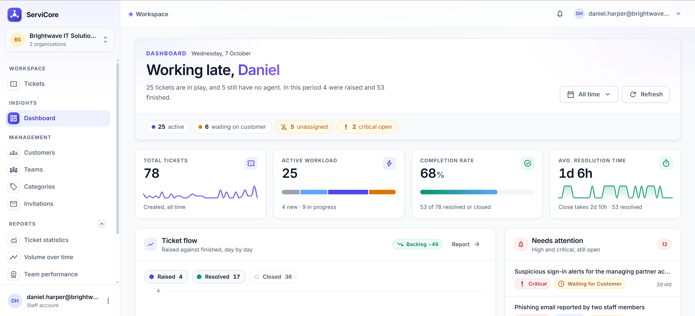
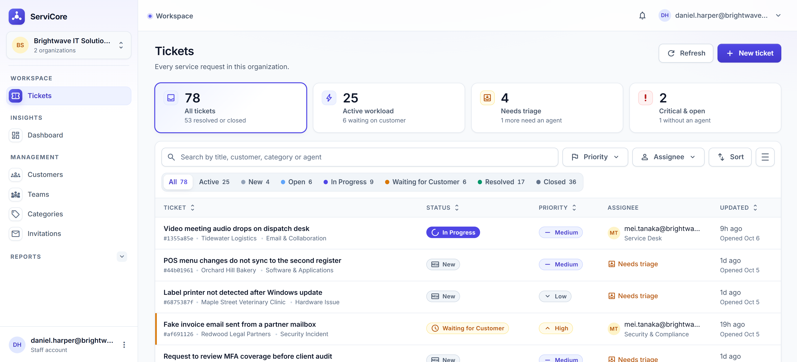
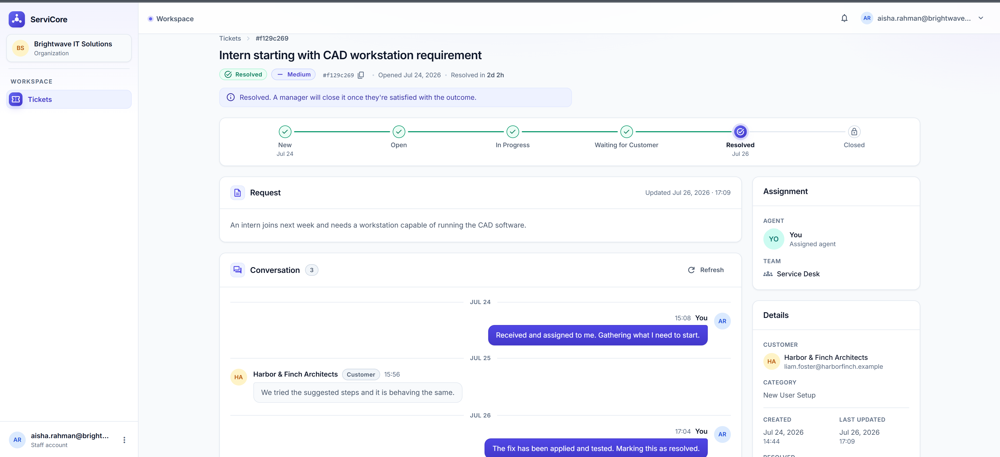
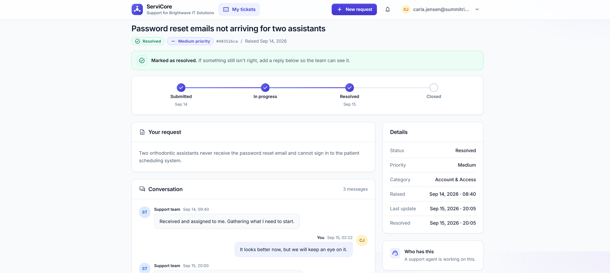
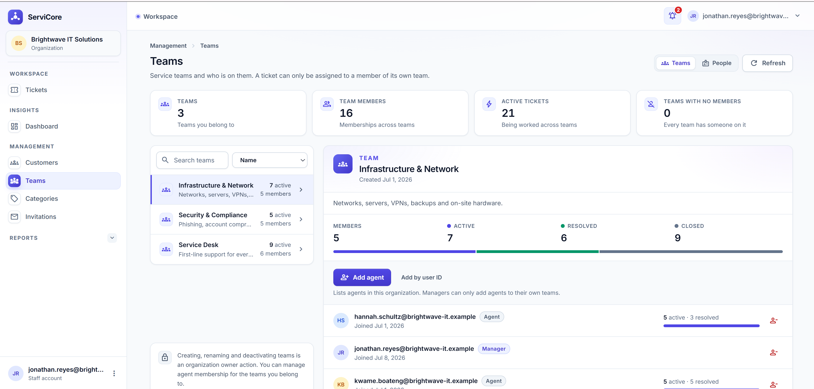
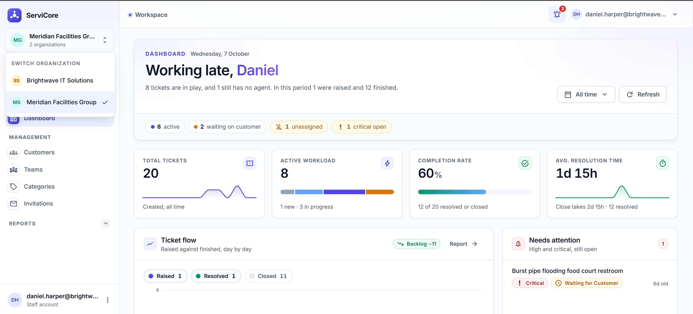

# ServiCore Frontend

The Angular frontend for **ServiCore**, a multi-tenant customer support and ticket management platform.

ServiCore provides separate experiences for organization staff and customers while enforcing organization-aware authorization and tenant isolation through the backend API.

## Live Demo

**https://servicore-lovat.vercel.app/**

## Repositories

- **Frontend:** https://github.com/AhmedMohamed2022/ServiCore-Multi-Tenant-Service-Management-Platform-Frontend
- **Backend:** https://github.com/AhmedMohamed2022/ServiCore-Multi-Tenant-Service-Management-Platform-Backend

## Screenshots



*Organization dashboard with ticket statistics, activity, and reporting.*



*Ticket queue with organization-scoped ticket management.*



*Ticket lifecycle, assignment, details, and customer conversation.*



*Dedicated customer portal for creating and tracking support requests.*



*Team and membership management.*



*The same account can switch between organizations with organization-specific roles.*

---

## Frontend Responsibilities

The Angular application provides:

- Staff workspace for Owners, Managers, and Agents.
- Customer support portal.
- Organization switching.
- Role-aware navigation and actions.
- Ticket creation, listing, details, assignment, and lifecycle management.
- Ticket conversations and comments.
- Team and membership management.
- Customer management.
- Category management.
- Staff and customer invitation workflows.
- Notifications and realtime updates.
- Organization-aware reporting dashboards.
- Responsive layouts for desktop and smaller screens.

The frontend is intentionally treated as a client of the backend authorization model. UI guards improve the user experience, but security-sensitive authorization remains enforced by the API.

---

## Application Structure

The frontend is organized by application responsibility rather than one large collection of components:

```text
src/app
├── core
│   ├── auth
│   ├── guards
│   ├── interceptors
│   ├── models
│   ├── services
│   └── tokens
│
├── features
│   ├── auth
│   ├── customer-portal
│   ├── dashboard
│   ├── management
│   ├── shell
│   └── tickets
│
└── shared
    ├── charts
    ├── pipes
    ├── ticket
    └── ui
```

### Core

Contains application-wide infrastructure such as:

- Authentication
- JWT handling
- HTTP interceptors
- Tenant context
- Authorization guards
- Shared API services
- Application models

### Features

Feature areas are isolated into focused modules/components:

- Authentication
- Dashboard and reporting
- Ticket management
- Customer portal
- Organization management
- Application shell

### Shared UI

Reusable UI primitives are kept under the shared layer, including:

- Avatars
- Buttons and controls
- Dialogs
- Icons
- Page headers
- Statistic cards
- Loading/empty/error states
- Ticket badges
- Toast notifications

---

## Multi-Tenant Frontend Design

The application maintains an active organization context for authenticated users who belong to multiple organizations.

The selected organization is propagated to backend API requests through the tenant context mechanism.

This allows the same authenticated account to operate under different organizations while receiving the correct organization-specific data and permissions.

For example:

```text
Daniel Harper

Brightwave IT Solutions
→ Owner

Meridian Facilities Group
→ Manager
```

The organization identifier is treated as an internal tenant identifier. Customers are not required to manually enter organization GUIDs to use the portal.

---

## Authentication & Authorization

The frontend uses:

- JWT bearer authentication
- Route guards
- Permission-aware navigation
- Organization-aware context
- HTTP interceptors
- Protected feature routes

Examples of protected frontend areas include:

```text
/app/dashboard
/app/tickets
/app/management/teams
/app/management/customers
/app/management/categories
/app/management/invitations
/app/reports/*
/portal/*
```

Frontend authorization is primarily concerned with navigation and user experience.

The backend remains the authoritative security boundary and independently validates authentication, organization membership, roles, ownership, and resource access.

---

## Realtime Communication

The application uses **Microsoft SignalR** for realtime events.

Realtime functionality supports scenarios such as:

- New notifications
- Ticket comments
- Ticket assignments
- Ticket status changes
- Ticket resolution
- Ticket closure

SignalR connections are associated with the authenticated user and active organization so realtime events remain tenant-aware.

---

## Reporting

The frontend provides reporting views for:

- Ticket statistics
- Team performance
- Agent performance
- Customer activity
- Category activity
- Ticket time-series data

Charts are implemented using `@swimlane/ngx-charts`.

---

## Technology Stack

| Area | Technology |
|---|---|
| Framework | Angular 19 |
| Language | TypeScript |
| UI | Tailwind CSS 3 |
| Component Library | Angular Material / CDK |
| State / Reactivity | Angular Signals + RxJS |
| Realtime | Microsoft SignalR |
| Charts | ngx-charts |
| Authentication | JWT |
| API | ASP.NET Core 8 Web API |
| Deployment | Vercel |

---

## Configuration

The production API URL is supplied through an environment variable:

```text
SERVICORE_API_BASE_URL
```

The build process generates the production Angular environment configuration from this value.

Example:

```text
SERVICORE_API_BASE_URL=https://your-backend.runasp.net/api
```

The API URL is configuration rather than a hard-coded production value.

---

## Local Development

Install dependencies:

```bash
npm install
```

Start the Angular development server:

```bash
ng serve
```

Then open:

```text
http://localhost:4200
```

The development environment is configured to communicate with the local ServiCore API.

---

## Production Build

The production build generates the API environment configuration before compiling Angular:

```bash
npm run build
```

The generated application is deployed to Vercel.

---

## Testing

The frontend contains unit tests for important application services, guards, interceptors, and components.

Run the test suite with:

```bash
npm test
```

---

## Backend

The Angular application depends on the ServiCore ASP.NET Core backend for:

- Authentication
- Authorization
- Tenant resolution
- Business rules
- Ticket management
- Customer management
- Team management
- Reporting
- Notifications
- Persistence

See the backend repository for the API architecture, domain model, database, migrations, and security implementation.

---

## Project Status

**ServiCore v1.0 — Deployed**

The frontend currently provides the complete v1 user experience for the multi-tenant support platform.

Future improvements are tracked in the backend project's roadmap and will be introduced based on product requirements rather than adding unnecessary complexity to the v1 release.
